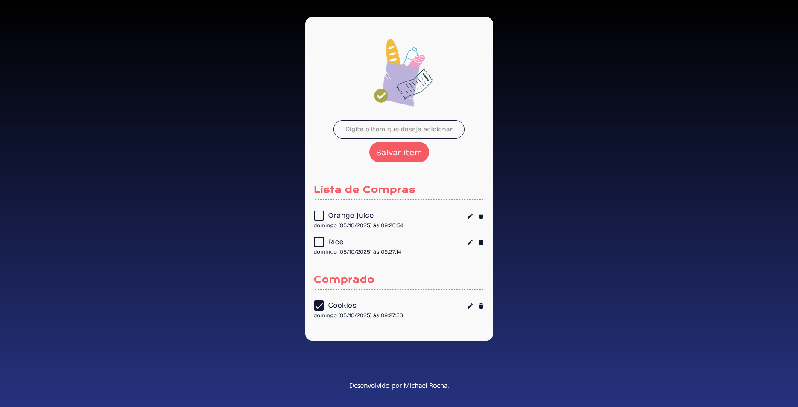

# shopping-list

This project is a Supermarket Shopping To-Do List website that helps users organize their shopping items efficiently. Users can add, edit, delete, or mark items as purchased.

---

## ✨ Features

- 📝 Add new items with an automatic creation date.

- ✏️ Edit item text anytime to update your shopping list.

- ❌ Delete items that you no longer need to buy.

- ✅ Mark items as purchased using a checkbox — they automatically move to the “Purchased” section.

- 💾 Persistent storage with localStorage, so your data is saved locally even after closing the page.

- 📦 Two main sections:

To Buy – displays all pending shopping items.

Purchased – shows all items marked as bought.

---

## 🚀 Technologies

This project was developed with the following technologies:

- HTML
- SCSS
- JavaScript

---

## 📷 Screenshots

### Desktop


---

## 📦 How to use

1. Clone the repository:
```bash
git clone https://github.com/michaelprocha/shopping-list.git
```

2. Run it through a local server (for example, using VS Code Live Server extension).

---

## 👨‍💻 Author

Made by [Michael Rocha](https://github.com/michaelprocha)

---

## 📄 License

This project is licensed under the MIT License. See the LICENSE file for more details.